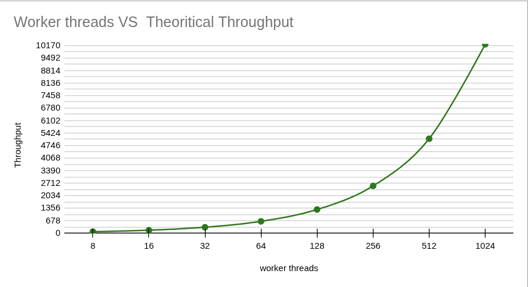
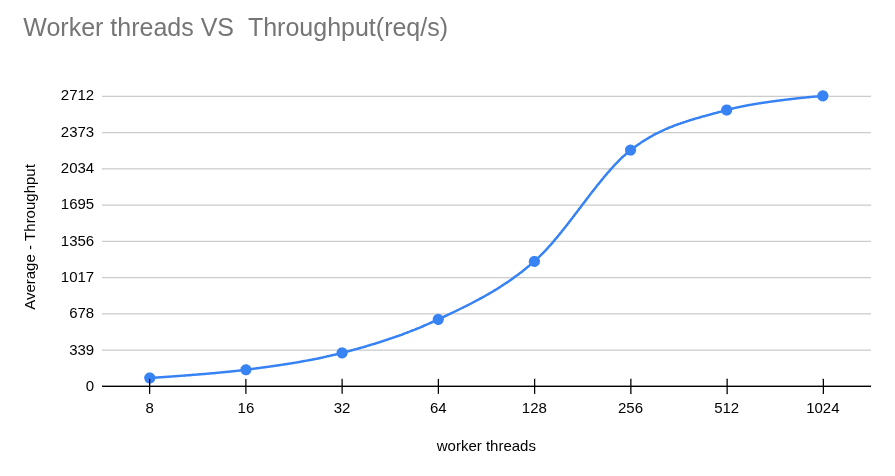
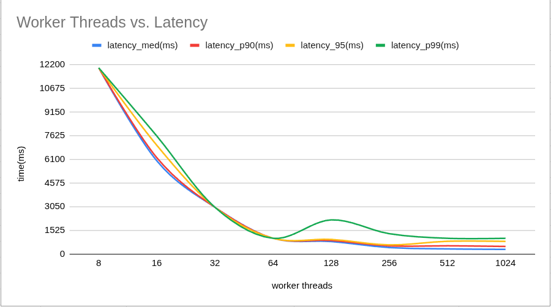
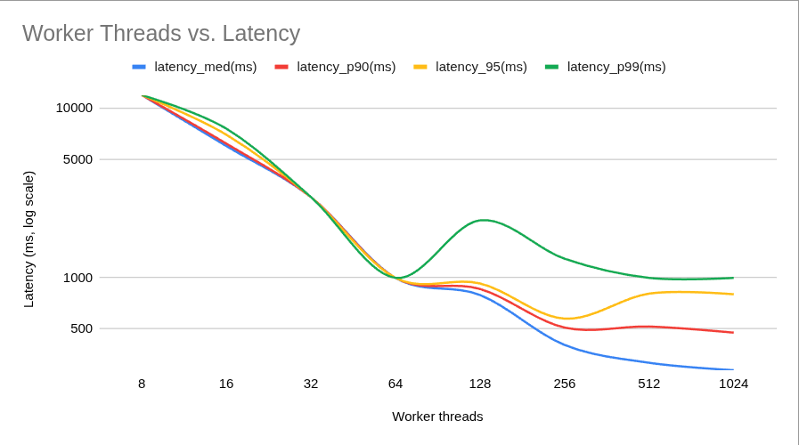
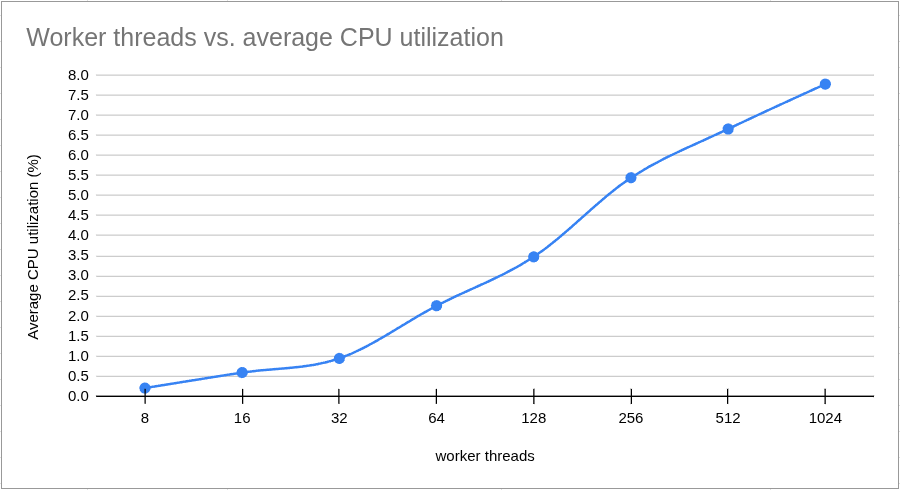
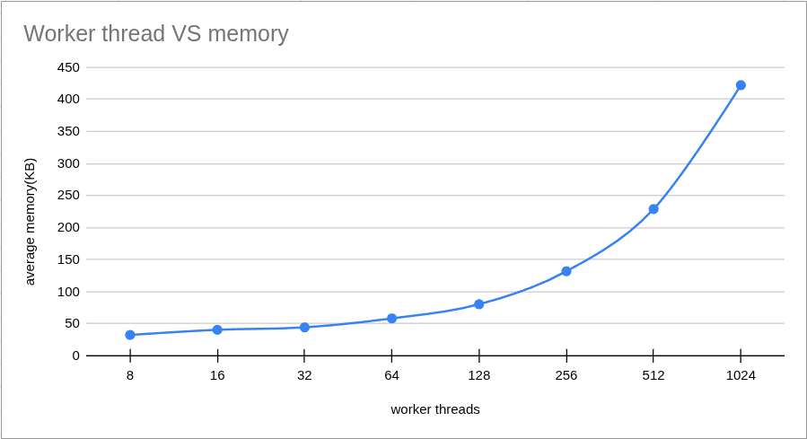

# SRPC Benchmark 1

On verserion 4.x.x was conducted the first benchmark of the framework.

## The aim

SRPC currently uses a thread-per-request execution model, where incoming requests are processed by a fixed number(8) worker thread pool. The aim of this Benchmark is to identify "to what extent does this approach scale?" while I encreasing the number of works.

## Experiment design

The experiment consider the scnario where the procedure called is IO-bound, so each request reaches a server procedure whose work always takes 100ms to complete.
The server was tested with 8 to 1,024 worker threads under 1,000 concurrent k6 virtual users for 60 seconds.

### Machines hardware

**Server side**
- Pocessor:   Sanapdragon(R) X - X126100 - Qualcomm(R) Oryon- (TM) CPU - 8 cores - 2.96 GHz
- RAM:    16.0 GB
- OS: Windows 11 Home

**Client side**
- Pocessor:   Intel(R) Core(TM) i7-2600 CPU @ 3.40GHz
- RAM:    15.0 G
- OS: 24.04.1-Ubuntu

### Tools
- On server side was used [resmon.exe](https://en.wikipedia.org/wiki/Resource_Monitor), allows to monitor CPU utilization and memory.

- On client side was used [xk6 and k6](https://medium.com/@marloh2222/utilizando-m%C3%B3dulos-do-xk6-com-k6-b068263b26e8), allows to monitor Latency and Throughput

### Metrics

- Latency : the end-to-end time observed by the client - from sending the request until receiving the complete response.
- Throughput: the number of requests the server successfully processes per second.
- Memory : amount of physical memory currently in use by the process.
- AVG CPU : process's average CPU utilization over a recent rolling time.

$$
\text{Latency} =
\text{Response completion time} - \text{Request start time}
$$

$$
\text{Throughput (req/s)} =
\frac{\text{Successfully completed requests}}{\text{Elapsed time (seconds)}}
$$

### Establishing a theoretical upper bound for Throughput

Since each request should take ~100 ms(0.1 s) to complete, ignoring all framework/network/scheduling overhead,
we can stabelish for each worker number an approximate theoretical value for Throughput. Look:

During one second, how many 100 ms requests can one worker complete? The answer is: exactly how many 100 ms we have in 1s(1000 ms):
$$
\frac{\text{100 ms}}{\text{1000 ms}} = 
\text{10}
$$

Now for one worker we have:

$$
\text{ Throughput}_1 =
\frac{\text{10 (requests)}}{\text{1 s}} = \text{10 (req/s)}
$$

So for W workers we have:

$$
\text{Throughput}_w =
\frac{\text{10 * W (requests)}}{\text{1 s}}
$$

| Workers | Theoretical Throughput capacity |
| ------: | ------------------------------: |
|       8 |                        80 req/s |
|      16 |                       160 req/s |
|      32 |                       320 req/s |
|      64 |                       640 req/s |
|     128 |                     1,280 req/s |
|     256 |                     2,560 req/s |
|     512 |                     5,120 req/s |
|    1024 |                    10,240 req/s |

### Metric collection
In total was taked 40 tries, 5 for each worker number. For each try was registred both, server side and client side metrics. 

- In server side the metrics(avg_cpu, memory) was registred by human observing the values of the metrics in resmon.exe interface. Was taked the max value observed doring 1 min, while the server was being bombarded with requests.

- In client side the metrics was all registred by k6. For latency was taked: median, p90,p95 and p99

## Results and analyses

### Througput

In throughput graphic we can see that the throughput increases as the number of worker threads increases. However, the gains are not linear. Up to 256 workers, increasing the thread pool produces substantial throughput gains. Beyond 256 workers, the improvement becomes progressively smaller, and the curve begins to flatten.

This behavior indicates we are approaching the saturation region, where adding more worker threads provides diminishing gains. Between 512 and 1024 workers, the additional throughput is particularly small. 

Therefore, 256 workers appears to be a practical scaling point, while 512+ workers operate close to the observed throughput ceiling.

### Latency

The latency results show that increasing the number of worker threads reduces request latency. This is consistent with the throughput results: 
with more workers available, more requests can be processed concurrently, reducing the time requests spend waiting for an available worker.

The largest latency improvements occur up to 256 worker threads. Beyond this point, the gains become progressively smaller, which is consistent with the diminishing throughput gains observed in the throughput analysis.

The P99 latency also shows a temporary increase at 128 workers, indicating higher tail latency at this configuration despite the improvement in median latency.

### AVG CPU

The CPU graphic show that CPU utilization increases as the number of worker threads increases. Since the called procedure is I/O-bound, additional workers allow the server to handle more requests concurrently while other workers are waiting on I/O.

As concurrency increases, the server performs more request-processing work per unit of time, which increases CPU utilization.

### Memory

The memory results show that increasing the number of worker threads increases the server's memory consumption.

Memory usage grows relatively slowly between 8 and 128 workers. However, the increase becomes considerably larger at higher worker counts, particularly between 256 and 1024 workers.

This behavior is expected because each additional worker thread introduces memory overhead, such as its thread stack and associated runtime and operating-system structures

## Conclusion and comments
Benchmarks with 1000 concurrent k6 virtual users showed strong scaling up to approximately 256 worker threads. Beyond this point, throughput gains diminished while CPU and memory usage continued to increase.